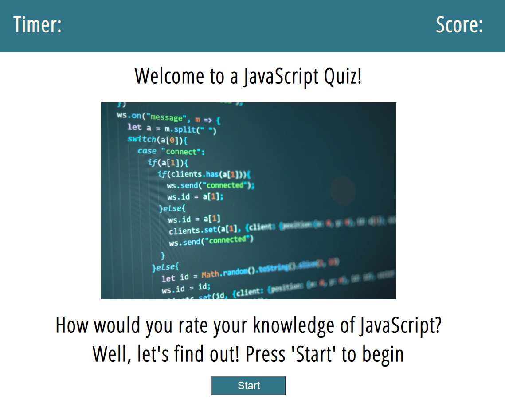

# Coding-Quiz

## Introduction:
How well do you know JavaScript? Well, what better place to test your knowledge than here? Put your brain to the test and see how you do! This quiz was created using HTML, CSS, and JavaScript. JavaScript is mainly used to populate the questions and record the user responses to check whether they're correct or not. There will be time deducted with each wrong answer. At the end of the quiz, you can record your name and have it stored. 

Below are links to the deployed link and GitHub repo. Feel free to take a look!

* [Deployed Link](https://dannyphan6.github.io/Coding-Quiz/)
* [GitHub Repository](https://github.com/dannyphan6/Coding-Quiz)

## Summary:
1. When the start button is clicked, you begin with 60 seconds
2. When an answer is answered incorrectly, deduct 10 seconds from the timer
3. When an answer is answered correctly, add 20 points to your score
4. When the quiz is finished, enter your name in the text box
5. Click the 'Submit' button to save your name and score
6. To attempt the quiz again, click the 'Restart' button
7. Enjoy!

